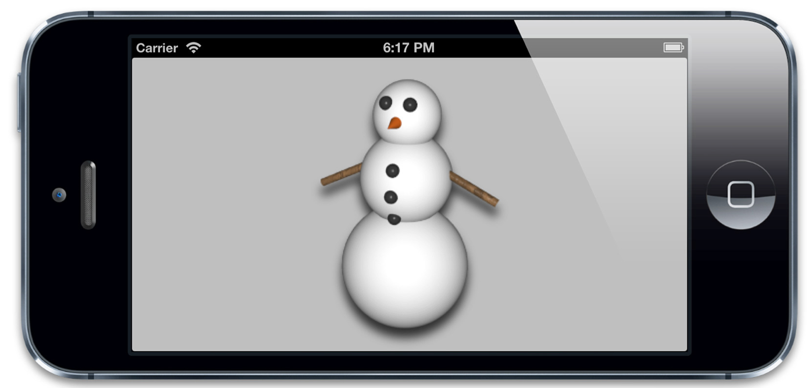
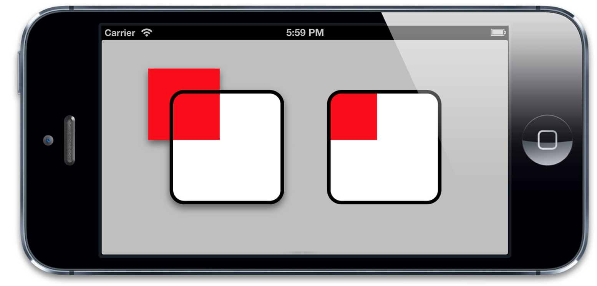
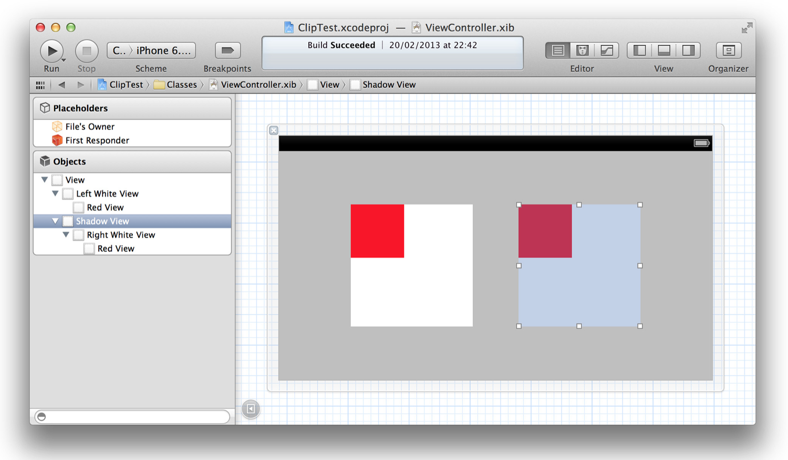
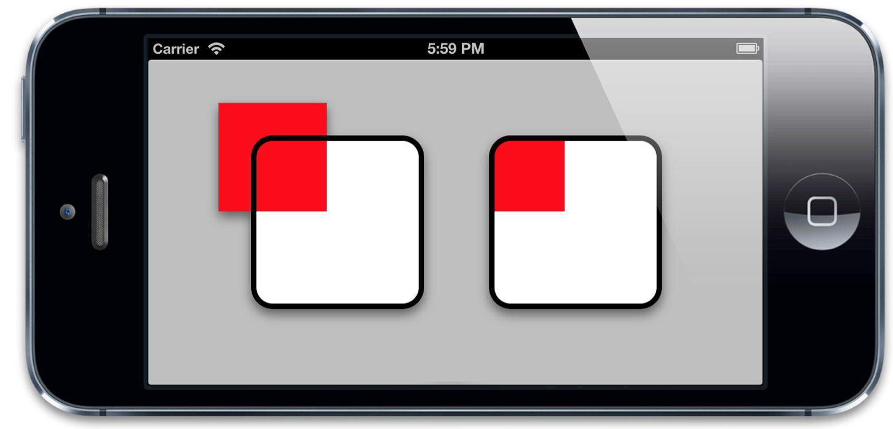
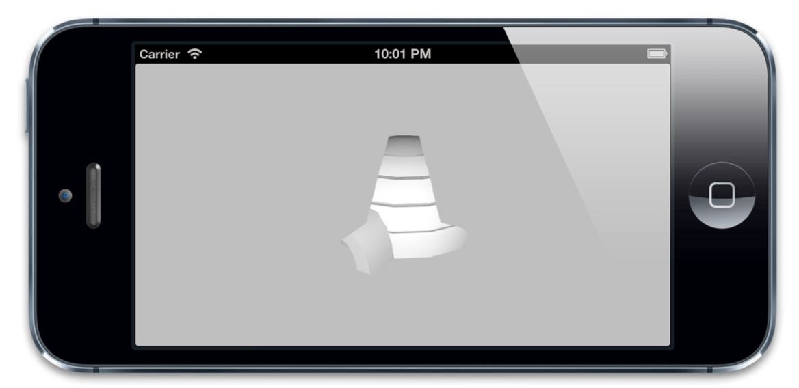
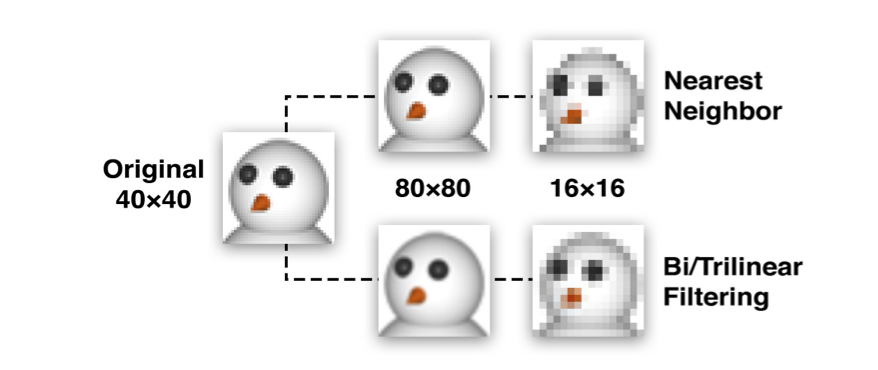
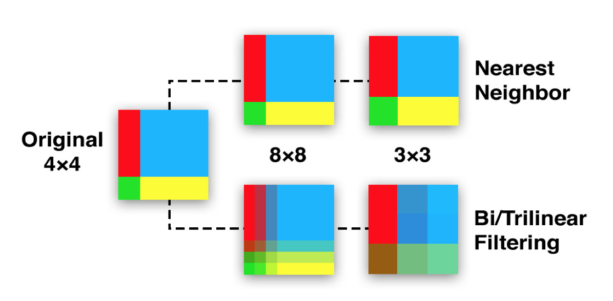
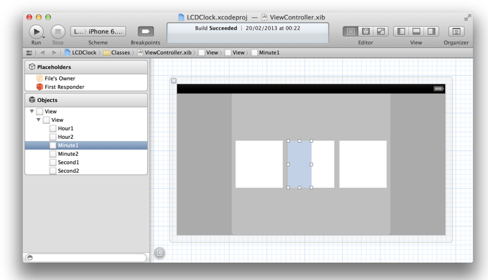
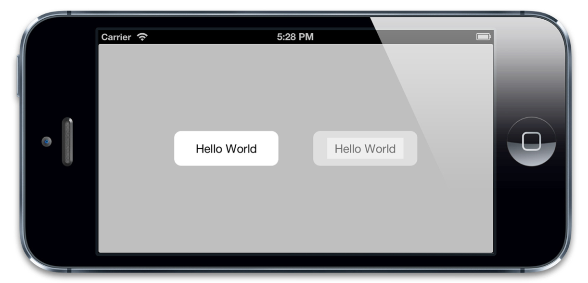
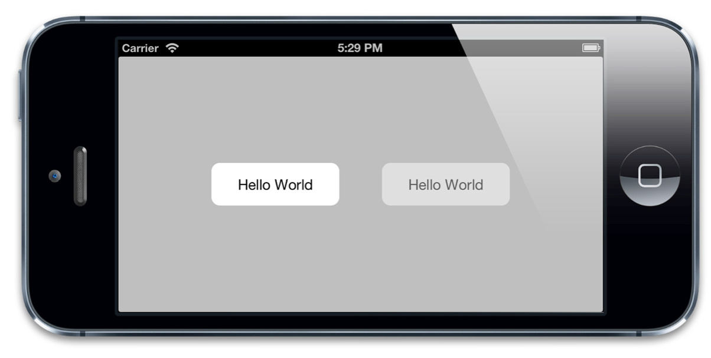

#视觉效果

>嗯，圆和椭圆还不错，但如果是带圆角的矩形呢？

>我们现在能做到那样了么？

>史蒂芬·乔布斯

我们在第三章『图层几何学』中讨论了图层的frame，第二章『寄宿图』则讨论了图层的寄宿图。但是图层不仅仅可以是图片或是颜色的容器；还有一系列内建的特性使得创造美丽优雅的令人深刻的界面元素成为可能。在这一章，我们将会探索一些能够通过使用CALayer属性实现的视觉效果。

##圆角

圆角矩形是iOS的一个标志性审美特性。这在iOS的每一个地方都得到了体现，不论是主屏幕图标，还是警告弹框，甚至是文本框。按照这流行程度，你可能会认为一定有不借助Photoshop就能轻易创建圆角矩形的方法。恭喜你，猜对了。

CALayer有一个叫做`conrnerRadius`的属性控制着图层角的曲率。它是一个浮点数，默认为0（为0的时候就是直角），但是你可以把它设置成任意值。默认情况下，这个曲率值只影响背景颜色而不影响背景图片或是子图层。不过，如果把`masksToBounds`设置成YES的话，图层里面的所有东西都会被截取。

我们可以通过一个简单的项目来演示这个效果。在Interface Builder中，我们放置一些视图，他们有一些子视图。而且这些子视图有一些超出了边界（如图4.1）。你可能无法看到他们超出了边界，因为在编辑界面的时候，超出的部分总是被Interface Builder裁切掉了。不过，你相信我就好了 :)


图4.1 两个白色的大视图，他们都包含了小一些的红色视图。

然后在代码中，我们设置角的半径为20个点，并裁剪掉第一个视图的超出部分（见清单4.1）。技术上来说，这些属性都可以在Interface Builder的探测板中分别通过『用户定义运行时属性』和勾选『裁剪子视图』(Clip Subviews)选择框来直接设置属性的值。不过，在这个示例中，代码能够表示得更清楚。图4.2是运行代码的结果

清单4.1 设置`cornerRadius`和`masksToBounds`

```objective-c
@interface ViewController ()

@property (nonatomic, weak) IBOutlet UIView *layerView1;
@property (nonatomic, weak) IBOutlet UIView *layerView2;

@end

@implementation ViewController
- (void)viewDidLoad
{
  [super viewDidLoad];

  //set the corner radius on our layers
  self.layerView1.layer.cornerRadius = 20.0f;
  self.layerView2.layer.cornerRadius = 20.0f;

  //enable clipping on the second layer
  self.layerView2.layer.masksToBounds = YES;
}
@end
```


右图中，红色的子视图沿角半径被裁剪了

如你所见，右边的子视图沿边界被裁剪了。

单独控制每个层的圆角曲率是不可能的，所以如果你想创建既有圆角又有直角的图层或视图时，就需要一些不同的方法。比如使用一个图层蒙板（本章稍后会讲到）或者是CAShapeLayer（见第六章『专用图层』）。

##图层边框

CALayer另外两个非常有用属性就是`borderWidth`和`borderColor`。二者共同定义了图层边的绘制样式。这条线（也被称作stroke）沿着图层的`bounds`绘制，同时也包含图层的角。

`borderWidth`是以点为单位的定义边框粗细的浮点数，默认为0.`borderColor`定义了边框的颜色，默认为黑色。

`borderColor`是CGColorRef类型，而不是UIColor，所以它不是Cocoa的内置对象。不过呢，你肯定也清楚图层引用了`borderColor`，虽然属性声明并不能证明这一点。`CGColorRef`在引用/释放时候的行为表现得与`NSObject`极其相似。但是Objective-C语法并不支持这一做法，所以`CGColorRef`属性即便是强引用也只能通过assign关键字来声明。

边框是绘制在图层边界里面的，而且在所有子内容之前，也在子图层之前。如果我们在之前的示例中（清单4.2）加入图层的边框，你就能看到到底是怎么一回事了（如图4.3）.

清单4.2 加上边框

```objective-c
@implementation ViewController

- (void)viewDidLoad
{
  [super viewDidLoad];

  //set the corner radius on our layers
  self.layerView1.layer.cornerRadius = 20.0f;
  self.layerView2.layer.cornerRadius = 20.0f;

  //add a border to our layers
  self.layerView1.layer.borderWidth = 5.0f;
  self.layerView2.layer.borderWidth = 5.0f;

  //enable clipping on the second layer
  self.layerView2.layer.masksToBounds = YES;
}

@end
```


图4.3 给图层增加一个边框

注意边框并不会考虑寄宿图或子图层的形状，如果图层的子图层超过了边界，或者是寄宿图在透明区域有一个透明蒙板，边框仍然会沿着图层的边界绘制出来（如图4.4）.


图4.4 边框是跟随图层的边界变化的，而不是图层里面的内容

##阴影

iOS的另一个常见特性呢，就是阴影。阴影往往可以达到图层深度暗示的效果。也能够用来强调正在显示的图层和优先级（比如说一个在其他视图之前的弹出框），不过有时候他们只是单纯的装饰目的。

给`shadowOpacity`属性一个大于默认值（也就是0）的值，阴影就可以显示在任意图层之下。`shadowOpacity`是一个必须在0.0（不可见）和1.0（完全不透明）之间的浮点数。如果设置为1.0，将会显示一个有轻微模糊的黑色阴影稍微在图层之上。若要改动阴影的表现，你可以使用CALayer的另外三个属性：`shadowColor`，`shadowOffset`和`shadowRadius`。

显而易见，`shadowColor`属性控制着阴影的颜色，和`borderColor`和`backgroundColor`一样，它的类型也是`CGColorRef`。阴影默认是黑色，大多数时候你需要的阴影也是黑色的（其他颜色的阴影看起来是不是有一点点奇怪。。）。

`shadowOffset`属性控制着阴影的方向和距离。它是一个`CGSize`的值，宽度控制着阴影横向的位移，高度控制着纵向的位移。`shadowOffset`的默认值是 {0, -3}，意即阴影相对于Y轴有3个点的向上位移。

为什么要默认向上的阴影呢？尽管Core Animation是从Layer Kit演变而来（可以认为是为iOS创建的私有动画框架），但是呢，它却是在Mac OS上面世的，前面有提到，二者的Y轴是颠倒的。这就导致了默认的3个点位移的阴影是向上的。在Mac上，`shadowOffset`的默认值是阴影向下的，这样你就能理解为什么iOS上的阴影方向是向上的了（如图4.5）.


图4.5 在iOS（左）和Mac OS（右）上`shadowOffset`的表现。

苹果更倾向于用户界面的阴影应该是垂直向下的，所以在iOS把阴影宽度设为0，然后高度设为一个正值不失为一个做法。

`shadowRadius`属性控制着阴影的*模糊度*，当它的值是0的时候，阴影就和视图一样有一个非常确定的边界线。当值越来越大的时候，边界线看上去就会越来越模糊和自然。苹果自家的应用设计更偏向于自然的阴影，所以一个非零值再合适不过了。

通常来讲，如果你想让视图或控件非常醒目独立于背景之外（比如弹出框遮罩层），你就应该给`shadowRadius`设置一个稍大的值。阴影越模糊，图层的深度看上去就会更明显（如图4.6）.


图4.6 大一些的阴影位移和角半径会增加图层的深度即视感

##阴影裁剪

和图层边框不同，图层的阴影来源于其内容的确切形状，而不是仅仅是边界和`cornerRadius`。为了计算出阴影的形状，Core Animation会将寄宿图（包括子视图，如果有的话）考虑在内，然后通过这些来完美搭配图层形状从而创建一个阴影（见图4.7）。



图4.7 阴影是根据寄宿图的轮廓来确定的

当阴影和裁剪扯上关系的时候就有一个头疼的限制：阴影通常就是在Layer的边界之外，如果你开启了`masksToBounds`属性，所有从图层中突出来的内容都会被才剪掉。如果我们在我们之前的边框示例项目中增加图层的阴影属性时，你就会发现问题所在（见图4.8）.



图4.8 `maskToBounds`属性裁剪掉了阴影和内容

从技术角度来说，这个结果是可以是可以理解的，但确实又不是我们想要的效果。如果你既想裁切内容又想有阴影效果，你就需要用到两个图层：一个只画阴影的空的外图层，和一个用`masksToBounds`裁剪内容的内图层。

如果我们把之前项目的右边用单独的视图把裁剪的视图包起来，我们就可以解决这个问题（如图4.9）.



图4.9 右边，用额外的阴影转换视图包裹被裁剪的视图

我们只把阴影用在最外层的视图上，内层视图进行裁剪。清单4.3是代码实现，图4.10是运行结果。

清单4.3 用一个额外的视图来解决阴影裁切的问题

```objective-c
@interface ViewController ()

@property (nonatomic, weak) IBOutlet UIView *layerView1;
@property (nonatomic, weak) IBOutlet UIView *layerView2;
@property (nonatomic, weak) IBOutlet UIView *shadowView;

@end

@implementation ViewController

- (void)viewDidLoad
{
  [super viewDidLoad];

  //set the corner radius on our layers
  self.layerView1.layer.cornerRadius = 20.0f;
  self.layerView2.layer.cornerRadius = 20.0f;

  //add a border to our layers
  self.layerView1.layer.borderWidth = 5.0f;
  self.layerView2.layer.borderWidth = 5.0f;

  //add a shadow to layerView1
  self.layerView1.layer.shadowOpacity = 0.5f;
  self.layerView1.layer.shadowOffset = CGSizeMake(0.0f, 5.0f);
  self.layerView1.layer.shadowRadius = 5.0f;

  //add same shadow to shadowView (not layerView2)
  self.shadowView.layer.shadowOpacity = 0.5f;
  self.shadowView.layer.shadowOffset = CGSizeMake(0.0f, 5.0f);
  self.shadowView.layer.shadowRadius = 5.0f;

  //enable clipping on the second layer
  self.layerView2.layer.masksToBounds = YES;
}

@end
```



图4.10 右边视图，不受裁切阴影的阴影视图。

## `shadowPath`属性

我们已经知道图层阴影并不总是方的，而是从图层内容的形状衍生而来。这看上去不错，但是实时计算阴影也是非常消耗资源的，尤其是当图层有多个子图层，每个图层还有一个有透明效果的寄宿图的时候。

如果你事先知道你的阴影形状会是什么样子的，你可以通过指定一个`shadowPath`来提高性能。`shadowPath`是一个`CGPathRef`类型（一个指向`CGPath`的指针）。`CGPath`是一个Core Graphics对象，用来指定任意的一个矢量图形。我们可以通过这个属性独立于图层形状之外指定阴影的形状。

图4.11 展示了同一寄宿图的不同阴影设定。如你所见，我们使用的图形很简单，但是它的阴影可以是你想要的任何形状。清单4.4是代码实现。


图4.11 用`shadowPath`指定任意阴影形状

清单4.4 创建简单的阴影形状

```objective-c
@interface ViewController ()

@property (nonatomic, weak) IBOutlet UIView *layerView1;
@property (nonatomic, weak) IBOutlet UIView *layerView2;
@end

@implementation ViewController

- (void)viewDidLoad
{
  [super viewDidLoad];

  //enable layer shadows
  self.layerView1.layer.shadowOpacity = 0.5f;
  self.layerView2.layer.shadowOpacity = 0.5f;

  //create a square shadow
  CGMutablePathRef squarePath = CGPathCreateMutable();
  CGPathAddRect(squarePath, NULL, self.layerView1.bounds);
  self.layerView1.layer.shadowPath = squarePath; CGPathRelease(squarePath);

  //create a circular shadow
  CGMutablePathRef circlePath = CGPathCreateMutable();
  CGPathAddEllipseInRect(circlePath, NULL, self.layerView2.bounds);
  self.layerView2.layer.shadowPath = circlePath; CGPathRelease(circlePath);
}
@end
```

如果是一个矩形或者是圆，用`CGPath`会相当简单明了。但是如果是更加复杂一点的图形，`UIBezierPath`类会更合适，它是一个由UIKit提供的在CGPath基础上的Objective-C包装类。

##图层蒙板

通过`masksToBounds`属性，我们可以沿边界裁剪图形；通过`cornerRadius`属性，我们还可以设定一个圆角。但是有时候你希望展现的内容不是在一个矩形或圆角矩形。比如，你想展示一个有星形框架的图片，又或者想让一些古卷文字慢慢渐变成背景色，而不是一个突兀的边界。

使用一个32位有alpha通道的png图片通常是创建一个无矩形视图最方便的方法，你可以给它指定一个透明蒙板来实现。但是这个方法不能让你以编码的方式动态地生成蒙板，也不能让子图层或子视图裁剪成同样的形状。

CALayer有一个属性叫做`mask`可以解决这个问题。这个属性本身就是个CALayer类型，有和其他图层一样的绘制和布局属性。它类似于一个子图层，相对于父图层（即拥有该属性的图层）布局，但是它却不是一个普通的子图层。不同于那些绘制在父图层中的子图层，`mask`图层定义了父图层的部分可见区域。

`mask`图层的`Color`属性是无关紧要的，真正重要的是图层的轮廓。`mask`属性就像是一个饼干切割机，`mask`图层实心的部分会被保留下来，其他的则会被抛弃。（如图4.12）

如果`mask`图层比父图层要小，只有在`mask`图层里面的内容才是它关心的，除此以外的一切都会被隐藏起来。


图4.12 把图片和蒙板图层作用在一起的效果

我们将代码演示一下这个过程，创建一个简单的项目，通过图层的`mask`属性来作用于图片之上。为了简便一些，我们用Interface Builder来创建一个包含UIImageView的图片图层。这样我们就只要代码实现蒙板图层了。清单4.5是最终的代码，图4.13是运行后的结果。

清单4.5 应用蒙板图层

```objective-c
@interface ViewController ()

@property (nonatomic, weak) IBOutlet UIImageView *imageView;
@end

@implementation ViewController

- (void)viewDidLoad
{
  [super viewDidLoad];

  //create mask layer
  CALayer *maskLayer = [CALayer layer];
  maskLayer.frame = self.imageView.bounds;
  UIImage *maskImage = [UIImage imageNamed:@"Cone.png"];
  maskLayer.contents = (__bridge id)maskImage.CGImage;

  //apply mask to image layer
  self.imageView.layer.mask = maskLayer;
}
@end
```



图4.13 使用了`mask`之后的UIImageView

CALayer蒙板图层真正厉害的地方在于蒙板图不局限于静态图。任何有图层构成的都可以作为`mask`属性，这意味着你的蒙板可以通过代码甚至是动画实时生成。

##拉伸过滤

最后我们再来谈谈`minificationFilter`和`magnificationFilter`属性。总得来讲，当我们视图显示一个图片的时候，都应该正确地显示这个图片（意即：以正确的比例和正确的1：1像素显示在屏幕上）。原因如下：

* 能够显示最好的画质，像素既没有被压缩也没有被拉伸。
* 能更好的使用内存，因为这就是所有你要存储的东西。
* 最好的性能表现，CPU不需要为此额外的计算。

不过有时候，显示一个非真实大小的图片确实是我们需要的效果。比如说一个头像或是图片的缩略图，再比如说一个可以被拖拽和伸缩的大图。这些情况下，为同一图片的不同大小存储不同的图片显得又不切实际。

当图片需要显示不同的大小的时候，有一种叫做*拉伸过滤*的算法就起到作用了。它作用于原图的像素上并根据需要生成新的像素显示在屏幕上。

事实上，重绘图片大小也没有一个统一的通用算法。这取决于需要拉伸的内容，放大或是缩小的需求等这些因素。`CALayer`为此提供了三种拉伸过滤方法，他们是：

* kCAFilterLinear
* kCAFilterNearest
* kCAFilterTrilinear

minification（缩小图片）和magnification（放大图片）默认的过滤器都是`kCAFilterLinear`，这个过滤器采用双线性滤波算法，它在大多数情况下都表现良好。双线性滤波算法通过对多个像素取样最终生成新的值，得到一个平滑的表现不错的拉伸。但是当放大倍数比较大的时候图片就模糊不清了。

`kCAFilterTrilinear`和`kCAFilterLinear`非常相似，大部分情况下二者都看不出来有什么差别。但是，较双线性滤波算法而言，三线性滤波算法存储了多个大小情况下的图片（也叫多重贴图），并三维取样，同时结合大图和小图的存储进而得到最后的结果。

这个方法的好处在于算法能够从一系列已经接近于最终大小的图片中得到想要的结果，也就是说不要对很多像素同步取样。这不仅提高了性能，也避免了小概率因舍入错误引起的取样失灵的问题



图4.14 对于大图来说，双线性滤波和三线性滤波表现得更出色

`kCAFilterNearest`是一种比较武断的方法。从名字不难看出，这个算法（也叫最近过滤）就是取样最近的单像素点而不管其他的颜色。这样做非常快，也不会使图片模糊。但是，最明显的效果就是，会使得压缩图片更糟，图片放大之后也显得块状或是马赛克严重。



图4.15 对于没有斜线的小图来说，最近过滤算法要好很多

总的来说，对于比较小的图或者是差异特别明显，极少斜线的大图，最近过滤算法会保留这种差异明显的特质以呈现更好的结果。但是对于大多数的图尤其是有很多斜线或是曲线轮廓的图片来说，最近过滤算法会导致更差的结果。换句话说，线性过滤保留了形状，最近过滤则保留了像素的差异。

让我们来实验一下。我们对第三章的时钟项目改动一下，用LCD风格的数字方式显示。我们用简单的像素字体（一种用像素构成字符的字体，而非矢量图形）创造数字显示方式，用图片存储起来，而且用第二章介绍过的拼合技术来显示（如图4.16）。


图4.16 一个简单的运用拼合技术显示的LCD数字风格的像素字体

我们在Interface Builder中放置了六个视图，小时、分钟、秒钟各两个，图4.17显示了这六个视图是如何在Interface Builder中放置的。如果每个都用一个淡出的outlets对象就会显得太多了，所以我们就用了一个`IBOutletCollection`对象把他们和控制器联系起来，这样我们就可以以数组的方式访问视图了。清单4.6是代码实现。




图4.17 在Interface Builder中放置的六个视图

清单4.6 显示一个LCD风格的时钟

```objective-c
@interface ViewController ()

@property (nonatomic, strong) IBOutletCollection(UIView) NSArray *digitViews;
@property (nonatomic, weak) NSTimer *timer;

@end

@implementation ViewController

- (void)viewDidLoad
{
  [super viewDidLoad]; //get spritesheet image
  UIImage *digits = [UIImage imageNamed:@"Digits.png"];

  //set up digit views
  for (UIView *view in self.digitViews) {
    //set contents
    view.layer.contents = (__bridge id)digits.CGImage;
    view.layer.contentsRect = CGRectMake(0, 0, 0.1, 1.0);
    view.layer.contentsGravity = kCAGravityResizeAspect;
  }

  //start timer
  self.timer = [NSTimer scheduledTimerWithTimeInterval:1.0 target:self selector:@selector(tick) userInfo:nil repeats:YES];

  //set initial clock time
  [self tick];
}

- (void)setDigit:(NSInteger)digit forView:(UIView *)view
{
  //adjust contentsRect to select correct digit
  view.layer.contentsRect = CGRectMake(digit * 0.1, 0, 0.1, 1.0);
}

- (void)tick
{
  //convert time to hours, minutes and seconds
  NSCalendar *calendar = [[NSCalendar alloc] initWithCalendarIdentifier: NSGregorianCalendar];
  NSUInteger units = NSHourCalendarUnit | NSMinuteCalendarUnit | NSSecondCalendarUnit;
  
  NSDateComponents *components = [calendar components:units fromDate:[NSDate date]];

  //set hours
  [self setDigit:components.hour / 10 forView:self.digitViews[0]];
  [self setDigit:components.hour % 10 forView:self.digitViews[1]];

  //set minutes
  [self setDigit:components.minute / 10 forView:self.digitViews[2]];
  [self setDigit:components.minute % 10 forView:self.digitViews[3]];

  //set seconds
  [self setDigit:components.second / 10 forView:self.digitViews[4]];
  [self setDigit:components.second % 10 forView:self.digitViews[5]];
}
@end
```

如图4.18，这样做的确起了效果，但是图片看起来模糊了。看起来默认的`kCAFilterLinear`选项让我们失望了。


图4.18 一个模糊的时钟，由默认的`kCAFilterLinear`引起

为了能像图4.19中那样，我们需要在for循环中加入如下代码：

```objective-c
view.layer.magnificationFilter = kCAFilterNearest;
```


图4.19 设置了最近过滤之后的清晰显示

##组透明

UIView有一个叫做`alpha`的属性来确定视图的透明度。CALayer有一个等同的属性叫做`opacity`，这两个属性都是影响子层级的。也就是说，如果你给一个图层设置了`opacity`属性，那它的子图层都会受此影响。

iOS常见的做法是把一个空间的alpha值设置为0.5（50%）以使其看上去呈现为不可用状态。对于独立的视图来说还不错，但是当一个控件有子视图的时候就有点奇怪了，图4.20展示了一个内嵌了UILabel的自定义UIButton；左边是一个不透明的按钮，右边是50%透明度的相同按钮。我们可以注意到，里面的标签的轮廓跟按钮的背景很不搭调。



图4.20 右边的渐隐按钮中，里面的标签清晰可见

这是由透明度的混合叠加造成的，当你显示一个50%透明度的图层时，图层的每个像素都会一半显示自己的颜色，另一半显示图层下面的颜色。这是正常的透明度的表现。但是如果图层包含一个同样显示50%透明的子图层时，你所看到的视图，50%来自子视图，25%来了图层本身的颜色，另外的25%则来自背景色。

在我们的示例中，按钮和表情都是白色背景。虽然他们都是50%的可见度，但是合起来的可见度是75%，所以标签所在的区域看上去就没有周围的部分那么透明。所以看上去子视图就高亮了，使得这个显示效果都糟透了。

理想状况下，当你设置了一个图层的透明度，你希望它包含的整个图层树像一个整体一样的透明效果。你可以通过设置Info.plist文件中的`UIViewGroupOpacity`为YES来达到这个效果，但是这个设置会影响到这个应用，整个app可能会受到不良影响。如果`UIViewGroupOpacity`并未设置，iOS 6和以前的版本会默认为NO（也许以后的版本会有一些改变）。

另一个方法就是，你可以设置CALayer的一个叫做`shouldRasterize`属性（见清单4.7）来实现组透明的效果，如果它被设置为YES，在应用透明度之前，图层及其子图层都会被整合成一个整体的图片，这样就没有透明度混合的问题了（如图4.21）。

为了启用`shouldRasterize`属性，我们设置了图层的`rasterizationScale`属性。默认情况下，所有图层拉伸都是1.0， 所以如果你使用了`shouldRasterize`属性，你就要确保你设置了`rasterizationScale`属性去匹配屏幕，以防止出现Retina屏幕像素化的问题。

当`shouldRasterize`和`UIViewGroupOpacity`一起的时候，性能问题就出现了（我们在第12章『速度』和第15章『图层性能』将做出介绍），但是性能碰撞都本地化了（译者注：这句话需要再翻译）。

清单4.7 使用`shouldRasterize`属性解决组透明问题

```objective-c
@interface ViewController ()
@property (nonatomic, weak) IBOutlet UIView *containerView;
@end

@implementation ViewController

- (UIButton *)customButton
{
  //create button
  CGRect frame = CGRectMake(0, 0, 150, 50);
  UIButton *button = [[UIButton alloc] initWithFrame:frame];
  button.backgroundColor = [UIColor whiteColor];
  button.layer.cornerRadius = 10;

  //add label
  frame = CGRectMake(20, 10, 110, 30);
  UILabel *label = [[UILabel alloc] initWithFrame:frame];
  label.text = @"Hello World";
  label.textAlignment = NSTextAlignmentCenter;
  [button addSubview:label];
  return button;
}

- (void)viewDidLoad
{
  [super viewDidLoad];

  //create opaque button
  UIButton *button1 = [self customButton];
  button1.center = CGPointMake(50, 150);
  [self.containerView addSubview:button1];

  //create translucent button
  UIButton *button2 = [self customButton];
  
  button2.center = CGPointMake(250, 150);
  button2.alpha = 0.5;
  [self.containerView addSubview:button2];

  //enable rasterization for the translucent button
  button2.layer.shouldRasterize = YES;
  button2.layer.rasterizationScale = [UIScreen mainScreen].scale;
}
@end
```



图4.21 修正后的图

##总结

这一章介绍了一些可以通过代码应用到图层上的视觉效果，比如圆角，阴影和蒙板。我们也了解了拉伸过滤器和组透明。

在第五章，『变换』中，我们将会研究图层变化和3D转换。
